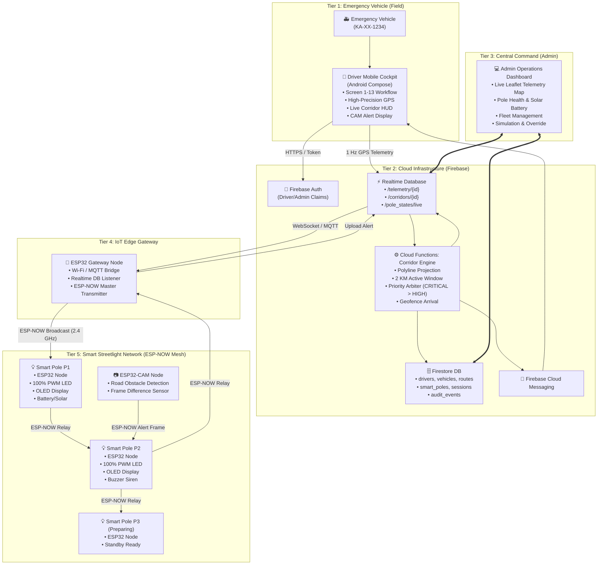
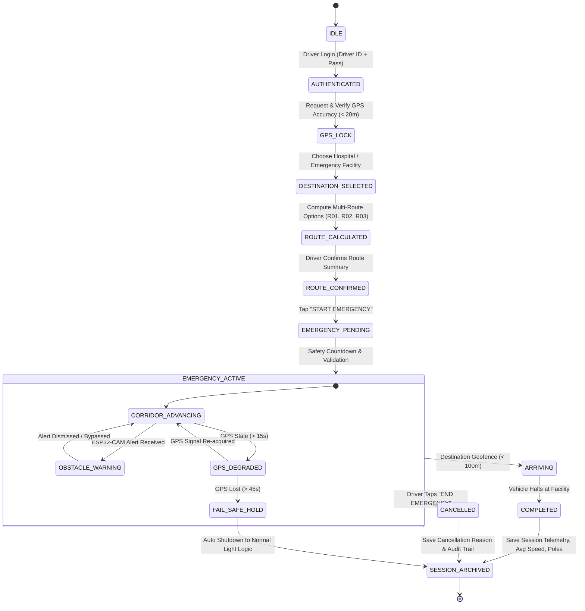

# SMART EMERGENCY CORRIDOR — SYSTEM ARCHITECTURE SPECIFICATION
**College Final-Year Project: IoT, Cloud & Mobile Emergency Corridor System**

---

## 1. Final Architecture Overview

The Smart Emergency Corridor is a distributed multi-tier cyber-physical system designed to dynamically prioritize emergency vehicle transit (Ambulances, Fire Trucks, Police) through dense urban networks. It establishes a moving 2-kilometer green-wave visual and physical safety corridor using smart connected streetlights.

The system is composed of five distinct interconnected tiers:
1. **Driver Mobile Cockpit (Native Android / Compose)**: Field terminal for authorized emergency drivers to authenticate, verify high-precision GPS lock, plan hospital routes, initiate authenticated emergency sessions, receive live ESP32-CAM obstacle alerts, and monitor upcoming pole activation states in real time.
2. **Admin Operations Center (Compose & Web Dashboard)**: Real-time telemetry map, vehicle fleet management, driver authorization, smart pole health/battery monitoring, priority dispatch oversight, and simulation controls.
3. **Cloud Intelligence Layer (Firebase Firestore & Realtime Database + Cloud Functions)**: High-frequency telemetry ingestion, route polyline projection, 2 KM dynamic activation engine, multi-emergency priority mediation, and event audit logging.
4. **IoT Gateway Subsystem (ESP32 Wi-Fi / LTE Gateway)**: Industrial-grade edge transceiver translating cloud corridor instructions into ultra-low-latency ESP-NOW peer-to-peer radio frames.
5. **Smart Streetlight Edge Nodes (ESP32 Nodes + ESP32-CAM)**: Microcontroller-governed streetlight poles featuring PWM LED drivers, LDR light level sensors, PIR motion detectors, MAX7219/OLED emergency displays, warning buzzers, solar battery management, and ESP-NOW mesh relaying.

---

## 2. Technology Stack & Architectural Justifications

| Subsystem | Technology Selected | Technical Justification |
|---|---|---|
| **Driver Mobile App** | Kotlin + Jetpack Compose (Native Android) | Deterministic background GPS sampling, hardware location provider binding, sub-millisecond reactive UI state updates via `StateFlow`, edge-to-edge tactical Material 3 interface optimized for high-stress operation. |
| **Admin Dashboard** | Dual: Compose Desktop/Tablet Native + Responsive Web (HTML5/ES6/Leaflet) | Allows instant on-device project defense demonstrations without external server dependencies, while providing deployable browser dashboard for remote dispatch centers. |
| **Persistent Data** | Cloud Firestore | ACID transactions for user authentication, vehicle registries, pole inventory, route polylines, and permanent emergency session audit histories. |
| **Real-time Telemetry** | Firebase Realtime Database (RTDB) | Extremely low latency (< 80ms) hierarchical WebSocket streaming for 1-second GPS breadcrumbs, active corridor pole bitmasks, and ESP-NOW packet forwarding. |
| **Backend Compute** | Firebase Cloud Functions (Node.js) | Server-side cryptographic token validation, route-pole spatial indexing, priority collision resolution, and FCM push distribution. |
| **Edge Microcontroller** | ESP32-WROOM-32 (C++ / Arduino Core) | Dual-core 240MHz MCU, integrated 2.4GHz radio supporting Wi-Fi station and ESP-NOW simultaneously, hardware PWM timers for LED dimming, and deep sleep support. |
| **Pole Mesh Protocol** | ESP-NOW (Proprietary 802.11 Action Frames) | Connectionless, low-overhead (~250 byte payload), 2–5 ms latency between poles up to 250m apart without router/AP dependence. |
| **Edge Vision Sensing** | ESP32-CAM (OV2640 + FreeRTOS) | Low-cost edge sensor capturing highway corridor stills, performing frame-differencing obstacle detection, and dispatching alerts to the gateway. |

---

## 3. System Architecture Diagram (Mermaid)



---

## 4. Emergency Corridor State Machine



---

## 5. Smart Pole State Machine

```mermaid
stateDiagram-v2
    [*] --> NORMAL
    
    state NORMAL {
        [*] --> DAY_OFF: LDR > Daylight Threshold
        DAY_OFF --> NIGHT_DIM: LDR < Darkness Threshold (15% Brightness)
        NIGHT_DIM --> MOTION_BRIGHT: PIR Triggered (60% Brightness, 30s)
        MOTION_BRIGHT --> NIGHT_DIM: Motion Timeout
        NIGHT_DIM --> DAY_OFF: Sunrise
    }

    NORMAL --> PREPARING: ESP-NOW / Cloud command (Vehicle 2.0–2.6 KM ahead)
    note right of PREPARING: Streetlight LED stays in ambient mode.\nOLED displays: "EMERGENCY APPROACHING"\nBuzzer armed in standby.

    PREPARING --> ACTIVE: Vehicle enters 0–2.0 KM corridor ahead
    note right of ACTIVE: Streetlight LED forced to 100% full brightness.\nOLED displays: "EMERGENCY: CLEAR LANE".\nHigh-vis strobe & acoustic beacon active.

    ACTIVE --> PASSED: Vehicle passes pole by > 150m (Hysteresis distance)
    note right of PASSED: Active session removed from pole slot.\nIf no other emergencies, transitions to NORMAL.\nLight returns to sensor-based dim/off.

    PASSED --> NORMAL: Safety timeout (5s) elapsed

    ACTIVE --> FAULT: Battery < 15% OR Driver Open-Circuit
    FAULT --> ADMIN_ALERT: Transmit Telemetry Fault Frame
    ADMIN_ALERT --> NORMAL: Fault Cleared Remotely
```

---

## 6. The 2 KM Corridor Algorithm

Traditional solutions use a naïve radial Euclidean distance $(d = \sqrt{\Delta x^2 + \Delta y^2} \le 2000\text{m})$. That approach fails in real road networks because:
1. It activates streetlights on parallel or perpendicular roads where the ambulance is not driving.
2. It activates streetlights *behind* the vehicle that have already been passed.

### Our Route-Aware Linear Projection Algorithm:
1. **Route Polyline Parametrization**: The selected route polyline is stored as an ordered sequence of GPS coordinates:
   $$R = [w_0, w_1, w_2, \dots, w_n]$$
2. **Cumulative Route Distance**: Each waypoint $w_i$ has a precomputed cumulative distance $D(w_i)$ from origin $w_0$.
3. **Vehicle Orthogonal Projection**: Given the vehicle's current GPS position $V = (\text{lat}_v, \text{lng}_v)$:
   - Find the nearest route segment $[w_k, w_{k+1}]$.
   - Project $V$ onto the segment to obtain the vehicle's current station along the route: $S_v$.
4. **Pole Sequence Projection**:
   - Each smart pole $P_j = (\text{lat}_j, \text{lng}_j)$ associated with the route is projected onto $R$ with station $S(P_j)$.
   - The road offset distance $d_\perp(P_j)$ is verified to be within the road corridor buffer ($\le 35\text{m}$).
5. **Relative Longitudinal Delta**:
   $$\Delta S_j = S(P_j) - S_v$$
6. **State Assignment Rules**:
   - If $\Delta S_j < -150\text{m}$ (hysteresis buffer): **PASSED** $\rightarrow$ Revert to **NORMAL**.
   - If $-150\text{m} \le \Delta S_j < 0\text{m}$ (vehicle adjacent/over pole): **ACTIVE**.
   - If $0\text{m} \le \Delta S_j \le 2000\text{m}$ (within 2 km forward window): **ACTIVE** (100% Brightness + OLED Message).
   - If $2000\text{m} < \Delta S_j \le 2600\text{m}$ (anticipatory buffer): **PREPARING** (Display standby warning).
   - If $\Delta S_j > 2600\text{m}$: **NORMAL** (Idle sensor-based lighting).

---

## 7. Multi-Emergency Priority & Conflict Arbitration

When multiple emergency vehicles navigate overlapping corridors (e.g., Ambulance A and Fire Truck B crossing the same avenue):

1. **Priority Hierarchy**:
   - Level 1: `CRITICAL` (e.g., Level 1 Trauma / Cardiac Ambulance, Fire Ladder in active blaze)
   - Level 2: `HIGH` (e.g., General Emergency Ambulance, Rescue Van)
   - Level 3: `NORMAL` (e.g., Non-critical Patient Transport, Police Patrol)
2. **Pole Multi-Tenant Slot Architecture**:
   Each pole node maintains a priority slot table:
   ```json
   {
     "poleId": "P02",
     "activeReservations": [
       {"emergencyId": "EMRG-001", "vehicleId": "KA-XX-1234", "priority": "CRITICAL", "state": "ACTIVE"},
       {"emergencyId": "EMRG-002", "vehicleId": "KA-XX-9999", "priority": "HIGH", "state": "PREPARING"}
     ],
     "dominantState": "ACTIVE",
     "dominantDisplay": "EMERGENCY: AMBULANCE + FIRE VEHICLE"
   }
   ```
3. **Arbitration Rules**:
   - **Precedence**: The highest priority emergency dictates the primary LED strobe pattern and visual messaging.
   - **No Contradiction**: If Vehicle A (passed) issues `DEACTIVATE` for Pole P2, but Vehicle B is still approaching and requires `ACTIVE`, Pole P2 **REMAINS ACTIVE**. Deactivation only drops the corresponding session from the pole's slot table; the pole reverts to NORMAL *only* when `activeReservations` is empty.
   - **Combined Alerting**: If two active vehicles are within 500m of the same intersection pole, the OLED switches to "INTERSECTION HAZARD: DUAL EMERGENCY APPROACH".

---

## 8. ESP-NOW Binary Protocol Specification

ESP-NOW transmits unencrypted or AES-128 encrypted vendor-specific 802.11 action frames. Our packet layout maximizes payload density and integrity:

```
 0                   1                   2                   3
 0 1 2 3 4 5 6 7 8 9 0 1 2 3 4 5 6 7 8 9 0 1 2 3 4 5 6 7 8 9 0 1
+-+-+-+-+-+-+-+-+-+-+-+-+-+-+-+-+-+-+-+-+-+-+-+-+-+-+-+-+-+-+-+-+
|   Magic (0xEC)|   Version (1) |          PacketSeqNo          |
+-+-+-+-+-+-+-+-+-+-+-+-+-+-+-+-+-+-+-+-+-+-+-+-+-+-+-+-+-+-+-+-+
|                          EmergencyId                          |
+-+-+-+-+-+-+-+-+-+-+-+-+-+-+-+-+-+-+-+-+-+-+-+-+-+-+-+-+-+-+-+-+
|    SourcePoleId (ASCII 4B)    |    TargetPoleId (ASCII 4B)    |
+-+-+-+-+-+-+-+-+-+-+-+-+-+-+-+-+-+-+-+-+-+-+-+-+-+-+-+-+-+-+-+-+
|  CommandCode  | PriorityLevel |   HopTTL (8)  | Reserved (0)  |
+-+-+-+-+-+-+-+-+-+-+-+-+-+-+-+-+-+-+-+-+-+-+-+-+-+-+-+-+-+-+-+-+
|                           Timestamp                           |
+-+-+-+-+-+-+-+-+-+-+-+-+-+-+-+-+-+-+-+-+-+-+-+-+-+-+-+-+-+-+-+-+
|                        CRC32 Checksum                         |
+-+-+-+-+-+-+-+-+-+-+-+-+-+-+-+-+-+-+-+-+-+-+-+-+-+-+-+-+-+-+-+-+
```

### Command Codes:
- `0x01`: `CMD_PREPARE_POLE`
- `0x02`: `CMD_ACTIVATE_POLE`
- `0x03`: `CMD_DEACTIVATE_POLE`
- `0x04`: `CMD_EMERGENCY_CANCEL`
- `0x05`: `CMD_HEARTBEAT`
- `0x06`: `CMD_STATUS_TELEMETRY`
- `0x07`: `CMD_OBSTACLE_ALERT` (from ESP32-CAM)
- `0x08`: `CMD_FAILSAFE_RESET`
